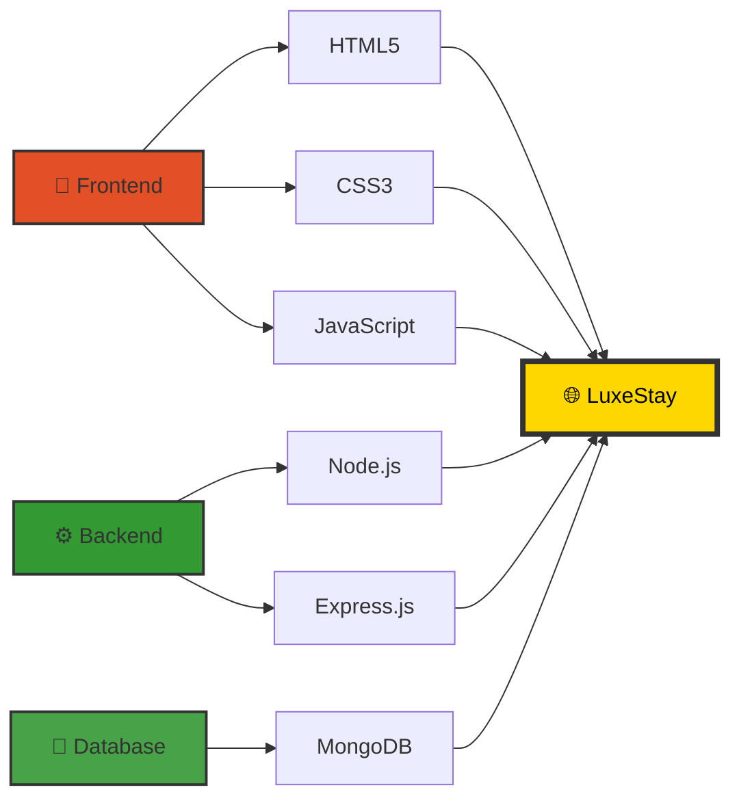

<div align="center">

# 🏨 LuxeStay Hotel

### *Where Luxury Meets Innovation*


[](https://github.com/Abhimanyuraj8252)
[](https://www.mongodb.com/)
[](https://nodejs.org/)
[](https://expressjs.com/)
[](https://developer.mozilla.org/en-US/docs/Web/HTML)
[](https://developer.mozilla.org/en-US/docs/Web/CSS)
[](https://developer.mozilla.org/en-US/docs/Web/JavaScript)


</div>

---

## 🌟 **Experience the Future of Hospitality**

> **LuxeStay** is not just a hotel booking platform—it's a **premium digital experience** crafted with cutting-edge technology and stunning design. Every pixel, every animation, every interaction is designed to captivate and inspire.

<div align="center">

### ✨ **Built for Excellence** ✨

</div>

```ascii
╔══════════════════════════════════════════════════════════════╗
║                                                              ║
║   🎯 Modern Architecture  |  💎 Premium Design              ║
║   ⚡ Lightning Fast       |  🔒 Secure & Reliable           ║
║   📱 Fully Responsive     |  🎨 Stunning Animations         ║
║                                                              ║
╚══════════════════════════════════════════════════════════════╝
```

---

## 🚀 **Features That Set Us Apart**

<table>
<tr>
<td width="50%">

### 🎨 **Frontend Excellence**
- ✅ **Responsive Design** - Perfect on all devices
- ✅ **Smooth Animations** - Buttery 60fps transitions
- ✅ **Premium UI/UX** - Glassmorphism & modern aesthetics
- ✅ **Interactive Elements** - Engaging user experience
- ✅ **Optimized Performance** - Lightning-fast load times

</td>
<td width="50%">

### ⚙️ **Backend Power**
- ✅ **Node.js & Express** - Robust server architecture
- ✅ **MongoDB Integration** - Scalable database solution
- ✅ **RESTful API** - Clean and efficient endpoints
- ✅ **Real-time Updates** - Instant booking confirmations
- ✅ **Secure Operations** - Industry-standard security

</td>
</tr>
</table>

---

## 📸 **Visual Showcase**

<div align="center">

### *Every Detail Crafted to Perfection*


</div>

---

## 🛠️ **Tech Stack**

<div align="center">



</div>

---

## 🚀 **Quick Start Guide**

### 📋 **Prerequisites**

```bash
Node.js >= 14.x
MongoDB >= 4.x
npm or yarn
```

### ⚡ **Installation**

<details open>
<summary><b>🔧 Backend Setup</b></summary>

```bash
# Navigate to server directory
cd server

# Install dependencies
npm install

# Start the server
npm start

# Server runs on → http://localhost:5000
```

</details>

<details open>
<summary><b>🎨 Frontend Setup</b></summary>

```bash
# Navigate to client directory
cd client

# Open in browser
# Simply open index.html in your favorite browser
# Or use Live Server for hot reload
```

</details>

---

## 📁 **Project Architecture**

```
luxstayhotel/
│
├── 📂 client/              # Frontend Application
│   ├── 📄 index.html       # Main landing page
│   ├── 📂 pages/           # Additional pages
│   ├── 🎨 *.css            # Premium stylesheets
│   └── ⚡ *.js             # Interactive scripts
│
├── 📂 server/              # Backend Application
│   ├── 📄 package.json     # Dependencies
│   ├── 🔧 server.js        # Express server
│   └── 📂 node_modules/    # Server dependencies
│
└── 📄 README.md            # You are here! 👋
```

---

## 🎯 **Key Highlights**

<div align="center">

| Feature | Description | Status |
|---------|-------------|--------|
| 🏠 **Home Page** | Stunning landing with hero section | ✅ Complete |
| 🛏️ **Rooms** | Luxury room showcase | ✅ Complete |
| 🍽️ **Dining** | Restaurant & cuisine display | ✅ Complete |
| 📅 **Booking** | Seamless reservation system | ✅ Complete |
| 🔐 **Backend API** | RESTful endpoints | ✅ Complete |
| 💾 **Database** | MongoDB integration | ✅ Complete |

</div>

---

## 🎨 **Design Philosophy**

> *"Luxury is in each detail"* - Hubert de Givenchy

Our design principles:
- 🌈 **Premium Aesthetics** - Gold accents, dark themes, glassmorphism
- ⚡ **Performance First** - Optimized for speed without compromising beauty
- 📱 **Mobile-First** - Responsive design that works everywhere
- ✨ **Micro-interactions** - Delightful animations that enhance UX
- 🎯 **User-Centric** - Intuitive navigation and seamless flow

---

## 🔮 **Future Enhancements**

- [ ] 🔐 User authentication & profiles
- [ ] 💳 Payment gateway integration
- [ ] 📧 Email notifications
- [ ] 🌍 Multi-language support
- [ ] 📊 Admin dashboard
- [ ] ⭐ Review & rating system
- [ ] 🤖 AI-powered recommendations

---

## 🤝 **Contributing**

We welcome contributions! Feel free to:

1. 🍴 Fork the repository
2. 🌿 Create your feature branch (`git checkout -b feature/AmazingFeature`)
3. 💾 Commit your changes (`git commit -m 'Add some AmazingFeature'`)
4. 📤 Push to the branch (`git push origin feature/AmazingFeature`)
5. 🎉 Open a Pull Request

---

## 📜 **License**

This project is crafted with ❤️ by [Abhimanyuraj8252](https://github.com/Abhimanyuraj8252)

---

<div align="center">

### 💫 **Made with Passion & Precision** 💫


### ⭐ **Star this repo if you love it!** ⭐

[](https://github.com/Abhimanyuraj8252)
[](https://github.com/Abhimanyuraj8252/luxstayhotel)

---

**[⬆ Back to Top](#-luxestay-hotel)**

</div>
